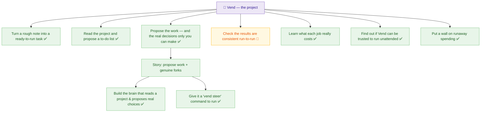

# Paper mock — the real Vend graph in the designer preset

**Date:** 2026-06-19 · **Prep deliverable #4** (`linear-surface-prep.md`). This renders the
**actual current project** (epics E-013…E-019, their stories and tickets — pulled from
`docs/active/`) through the **designer preset**, on paper, with **zero Linear dependency.** It
is the artifact to put in front of the designer to test the *"good enough"* bar before the MCP
exists. Two seats are shown from the **same canonical graph**: the **designer** view and the
**founder/director** brief.

> **Active preset (designer):** `vocabulary: plain · density: low · metaphor: tree ·
> color_language: state · face: [plain_title, why, state] · details: [codes, cites, baml, raw_ACs]`
> *Same graph, different preset → the founder brief at the bottom. Calibration edits this header,
> never the graph.*

---

## ◤ Designer view — the decomposition tree

A visual structure, plain language, dev detail tucked away. (Mermaid stands in for the Linear
render.)

### Card faces (what a node shows — plain, low-density)

> **Propose the work — and the real decisions only you can make** · ✅ Done
> *Why:* So you just say *yes* or *pick one*, instead of figuring out the work yourself.
> *What it does:* Reads the project, hands you a ranked to-do list **plus** the genuine
> either/or calls — and refuses to invent a fake decision to look useful.
> *[ Details ▸ ]* — Fork type · `SteerProject` BAML fn · read-never-invent + fork-genuineness
> gates · `survey-core.ts` cites *(the dev layer, one tap away)*

> **Check the results are consistent run-to-run** · 🔄 In progress
> *Why:* Consistency is the whole promise — if the same ask gives different answers, Vend isn't
> trustworthy yet.
> *What it does:* Runs the same job many times and measures how much the output wobbles.
> *[ Details ▸ ]* — `run-probe.ts` generalized · `variance.ts` · Jaccard dispersion

*(Every epic has a face like this. Designer reads the **why/what**; the dev opens **Details**.)*

---

## The translation that makes it digestible (before → after)

Real ticket `T-018-01`, the two seats side by side:

| The raw ticket (dev layer) | The designer face |
|---|---|
| `title: steer-pure-core` | **Build the brain that reads a project and proposes real choices** |
| `phase: done` | ✅ Done |
| *"the `SteerProject` BAML function … **PE-1** read-never-invent … **honest-empty** … composes into `Play.gates`"* | *"It produces a ranked list and flags the real decisions — and refuses to invent fake work just to look busy."* |
| `Cites: survey-core.ts, expand-core.ts, baml_src/ …` | *(hidden behind Details ▸)* |

Not one charter code, file path, or `BAML` on the face. The meaning is preserved; the jargon is gone.

---

## ◤ Founder/director view — the brief *(same graph, `density: brief · group_by: epic`)*

> ### Vend — where it stands *(read in under a minute)*
>
> **Direction:** the articulation trilogy — *note → task*, *read project → to-do list*,
> *propose work + decisions* — **all landed.** Now **validating** that results are consistent.
>
> | Theme | State |
> |---|---|
> | Turn a rough note into a ready-to-run task | ✅ Done |
> | Read the project & propose a to-do list | ✅ Done |
> | Propose the work + the real decisions | ✅ Done |
> | **Check results are consistent run-to-run** | 🔄 **In progress** *(the one thing moving)* |
> | Learn what each job really costs · trust-to-run-unattended · spending wall | ✅ Done |
>
> **The one decision waiting on you:** can Vend be trusted to run *fully* unattended? — measured
> as **not yet** (walk-away unproven). The big "allocate 2 hours and walk away" feature stays
> **parked** until that turns green. *(No padding: nothing else is materially in flight.)*

No tickets, no IDs, no jargon — shape, direction, and the single call that's the director's.

---

## A post-it, round-tripped *(Story 7 — shown, gated on charter ratification)*

> 🟨 *Designer leaves on the "Check results are consistent" card:*
> **"the wobble number means nothing to me — can it say pass/fail?"**
>
> → returns to Vend as a **proposed signal** (via `expand-fragment`): *"Add a plain pass/fail
> verdict to the consistency view"* → lands in the **clearing queue** → the overseer **pulls**
> it. The post-it never edits the graph directly — it becomes **demand**. *(Two-way data,
> one-way authority.)*

---

## How to read this mock (for the designer test)

Score it on the five **"good enough"** dimensions (`linear-surface-prep.md`):
**comprehension** (could you explain each card without a developer?) · **structure** (can you see
how it breaks down?) · **density** (too much / too little?) · **language** (any word you'd
rewrite?) · **navigability** (could you find and steer?). Where it fails, we **turn a knob** in
the preset header — *not* the graph — and re-render. That loop, converged and saved, is the
deliverable the Linear render will execute.
